# 第二章 数据信息表示与运算
## 原码表示：
- 原码移位：**符号位不变**，数值位左右移，补0。
## 补码表示：
- 补码0唯一：0.000000...
- 机器正负数转换：
    1. $[x]_补$称为机器正数；$[-x]_补$称为机器负数。
    
    2. 计算机器负数$[-x]_补$：将$[x]_补所有位（包括符号位）取反加1$

- 补码右移：符号位不变，高位补符号
- 补码左移：连符号位一起左移，低位补0。**如果移位导致符号位改变就说明移除了有效位，出错。**

- 两补码位数不同不能相互加减，要扩展到相同位。
## 移码表示：
- 移码0：10000...，唯一
- 移码 = 补码 + 符号位取反
- 移码无论正负，都可以直接按照无符号数比较大小。

## 定点表示
小数点位置不变
- 定点小数：$x_{阶码}.x1x2x3$
- 定点整数：$x_{阶码}x1x2x3._{隐含}$
### 表示范围：
- 原码、反码：
    - 最大正数:0 1111111,$2^{n}-1$;0.1111111,$1-2^{-n}$
    - 最大负数:1 0000001,$-1$;1.0000001,$-2^{-n}$
    - 最小正数:0 0000001,$1$;0.00000001,$2^{-n}$
    - 最小负数:1 1111111,$-2^{n}+1$;1.1111111,$1-2^{-n}$
- 补码：
    - 最大负数:1 1111111,$-1和2^{-n}$
    - 最小负数:1 0000000,$-2^n和-1(定点小数)$。对于补码-1(纯小数1.0000000)、$-2^n$(纯整数1000000)的首位1既表示符号位也表示数值。
- 移码：符号位也取反的补码.可以表示到-1(0.000...)和$-2^n$(000000...j)
### 溢出定义
- 上溢出:**小于最小负数**或**大于最大整数**
- 下溢出:**大于最大负数**且**小于最小正数**，即机器零位置
- 正溢出:大于最大正数
- 负溢出:小于最小负数
### 分辨率
相邻两点的距离。定点整数1，定点小数$2^-n$
### 定点机
仅支持定点表示的机器
### 定点加减法
- 加法
$[x]_补+[y]_补=[x+y]_补$
- 减法
$[x]_补-[y]_补=$**$[x]_补+[-y]_补$**$=[x-y]_补$
- 符号位同时参与计算，若进位超过模则丢模。
- 溢出：
    - xy相互异号不溢出
    - xy同号，若结果符号与xy不同则溢出。
    - $溢出判断OVR = s_0 异或 x_0 异或 y_0 = 符号位进位 异或 最高位进位$
- 变形补码运算
符号位使用两位，如00 00000010。**无论是否溢出，最左侧符号永远正确**。
    - 设两个符号位为$s_{f1},s_{f2}$,则$OVR=s_{f1} 异或 s_{f2}$
    - 00/11 ：未溢出
    - 01 ：00 的最高位进位，而$s_{f1}未进位，正溢出$
    - 10 ：11 的最高位未进位，而$s_{f2}$变为0，负溢出$

### 定点乘法
- 设乘积符号为$z_f$，则$z_f = x_f 异或 y_f$。
- **两个n位数相乘，得到2n位乘积**
- **原码乘法**：
     单符号位，绝对值运算 
    1. 计算符号位
    2. 初始部分积为0，连接上乘数y的绝对值部分（被乘数作为x），从乘数最低位开始，如果是1则部分积+x；如果是0则不加。
    3. 右移部分积和乘数
    4. 重复2、3
    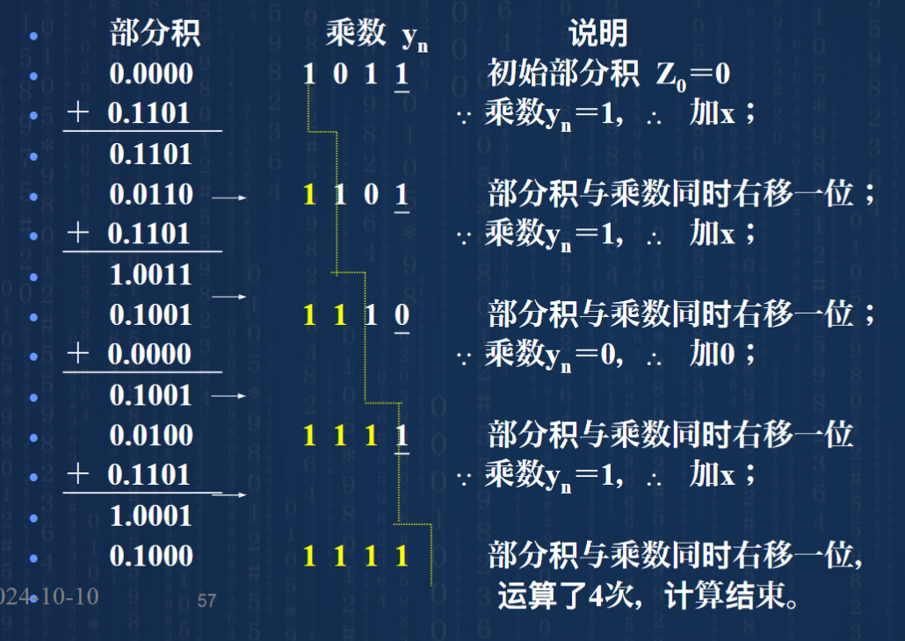
- **补码乘法(布斯乘法)**：
     被乘数双符号位，乘数单符号位，原值运算 
    xy均以补码表示，且需要双符号位。带符号位共n+2位。
    1. 初始部分积(n+2位)为0，连接上乘数y(n+1+1=n+2位)，且y的最低位再加上一位0，即$y_{n+1}=0$
    2. 用$y_n$和$y_{n+1}$作为判别位，$(y_{n+1}-y_{n}) * x$加上部分积，即两判别位00、11时，加0；01时，加$x_补$；10时，加$[-x]_补$。
    3. 右移部分积和y
    4. 重复n+1次2、3，**但最后一次不用移位**,得到2n位则结束
    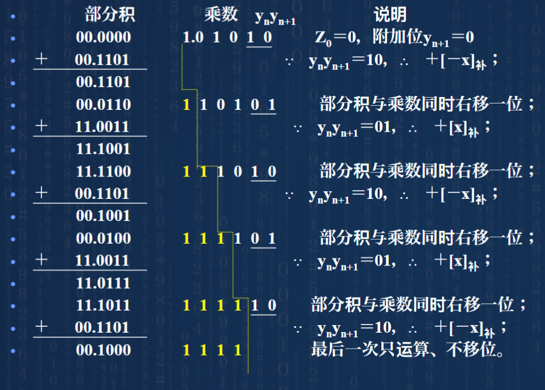
### 定点除法
**整数除法中被除数>除数，结果>1。而小数除法中被除数<除数，结果<1**
- 原码除法
     双符号位，绝对值运算 
    原码的减法利用补码加减，$x-y = x + [-y]_补$
    - 原码恢复余数法:
        采用双符号位
        1. 判溢出，要求被除数>除数，结果>1。而小数除法中被除数<除数，结果<1
        2. 计算结果符号$s_f = x_0 \oplus y_0$。并将除数和被除数变为绝对值。
        3. 被除数 - 除数，余数为正则够减，最右位上商为1，余数拼接上商整体**左移**一位；若余数为负则不够减，相应位上商为0，将除数加回余数，余数上商左移一位。
        4. 重复3直到求出精确度为止。
        5. 最后的余数需要乘以$2^{-n}$才是真正的余数，即右移n次
        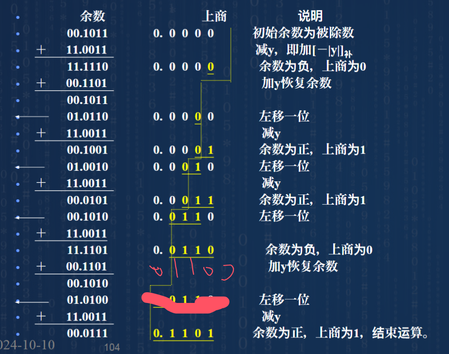
    - 原码不恢复余数法(加减交替法)
        原理：当余数<0时，**加除数再左移和在上一步减去除数前先左移再加是相同的**
        1. 判溢出
        2. 计算结果符号
        3. 被除数 - 除数。
        4. 如果余数>0，则上商为1，左移再减除数。如果余数<0，则上商为0，左移再加上除数。
        5. 重复4步骤n次，计算得到n位结果，如果最后一次余数仍然是负数，则需要再加上一个除数，得到余数。余数需要乘$2^{-n}$
        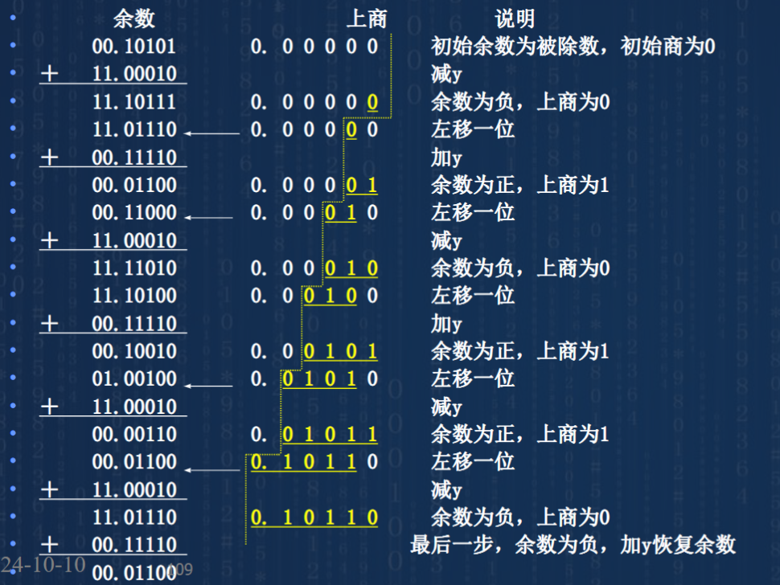
- 补码除法
    1. 判断够不够减：xy同号则$[x]_补-[y]_补$，xy异号则$[x]_补+[y]_补$。
    2. 第一步先按1中加减。之后若余数与除数同号则上商1，左移后-$[y]_补$；若余数与除数异号则上商0，左移+$[y]_补$
    3. 商矫正(上商按反码，需要+1)：
        - 末位恒置1
        - 除尽了：
            1. 除数正不矫正
            2. 除数负则最低位+1
        - 除不尽：
            1. 商为正不矫正
            2. 商为负最低位+1
    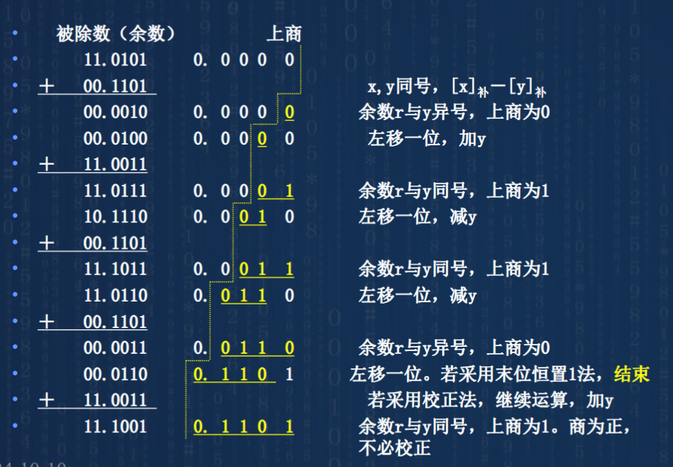
        
## 浮点表示
- 规格化：为了最大化精度且使浮点表示唯一化
    - 将S尾数中的第一位数字变为1，即$\frac{1}{2} \leq |S| < 1$。例如将$0.00101 * 2^{-5} 变为 0.101 * 2 {-7}$
    - 原码表示的规格化数$S_f.1S_2...$，其中要求$S_1=1$
    - 补码表示的规格化数S要求：**$S_f \oplus S_1 = 1$**，即符号位和第一位不相同。$1.0xxx$和$0.1xxx$
    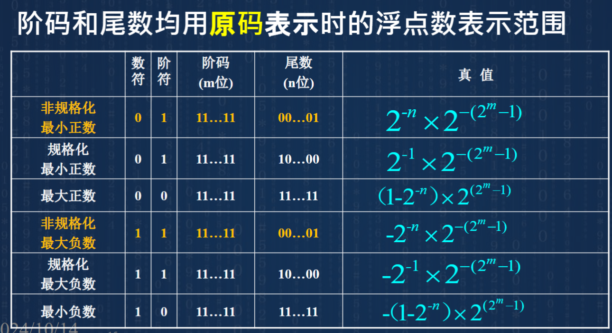
- 阶码m和尾数n位数的选择：
    - **阶码m位数越大，数表示范围越大**
    - **尾数n位数越大，数的精确度越高**
    - 单精度表示：用单字长表示；双精度：用双字长表示。
- 机器零：
    1. 尾数全0，无论阶码；
    2. 阶码小于最小阶码，$e<2^{-m}$，无论尾数。例如当使用补码表示时，阶码可能是$2^{-m}$（类似-128），则无论尾数都是0.
    3. 阶码是最小值时视为机器零，所以当**阶码采用移码、尾数采用补码时**，机器零表示全0.此时，对于非规格化数$00 000...000...1$最小，小于此数都是机器零；规格化数$00 000...100...$最小，小于此数都是机器零。
### IEEE754标准
![IEEE754]](image-4.png)
- 32位浮点数：
    - 1位数符S，8位阶码E，23位尾数M。表示了$(-1)^S×1.M×2^{E-127}$。
    - 即数符表示正负、阶码默认移127码表示（即阶码 = 127 + 实际阶;规定阶码在1-254,0和255用作特殊用途；实际阶范围-126-127）、尾数默认原码，由于规格化表示，默认小数点左侧有1，实际尾数24位。
    - 如下图所示，为了避免绝对值较小的数字下溢，允许使用E=0时的非规格化数来进行表示,**但此时小数点左侧隐含0，阶码位-126而不是0-127=-127**。
    - 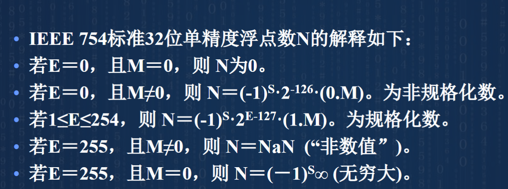
- 64位浮点数：1位S，11位E，52位M
### 浮点计算：
浮点计算时，阶码和尾数分开进行，规格化的计算精度更高，一般采用规格化计算。
- 规格化加减计算：
    $x = S_x × 2^{e_x}$
    $y = S_y × 2^{e_y}$
    先转换为机器数，看清补码还是原码。
    1. 对阶：两数阶码要相等。首先计算$\delta e = e_x-e_y$,然后使小阶向大阶对齐移位，将阶码小的尾数S向右位移$|\delta|位$
    2. 尾数求和/差。若溢出则需要右移解决溢出。
    3. 将结果规格化：为方便判断可以使用变补，两位符号位
        - 向左破坏规格化：尾数结果溢出；向右规格化，右移,**每移一位阶码都要+1**。
        - 向右破坏规格化：尾数没有溢出，但不满足规格化数要求。向左规格化，左移，**每移一位阶码-1**
        - 浮点计算中，通过规格化将不会影响运算结果。
    4. 舍入：防止阶码和尾数右移时丢失精度。
        - 截断法（恒舍法）：丢掉的全部舍去
        - 0舍1入法：被舍弃的最高位是0则舍去，是1则在右移后最低位+1。精度高但效率低。对于补码：
            1. 若舍去全为0，则不舍入
            2. 若舍去为0xxxx（xxxx不全为0）或100000...时，舍去丢失位上的值
            3. 若舍去为1xxxx时，舍去后入1
        - 末位置1法（冯诺依曼舍入法），无论怎样末位都置1，快但精度低。
        - 查表舍入法：制作ROM表舍入
    5. 溢出：看阶码是否上/下溢。下溢：当作机器零处理；**一般浮点数溢出是指上溢**。
    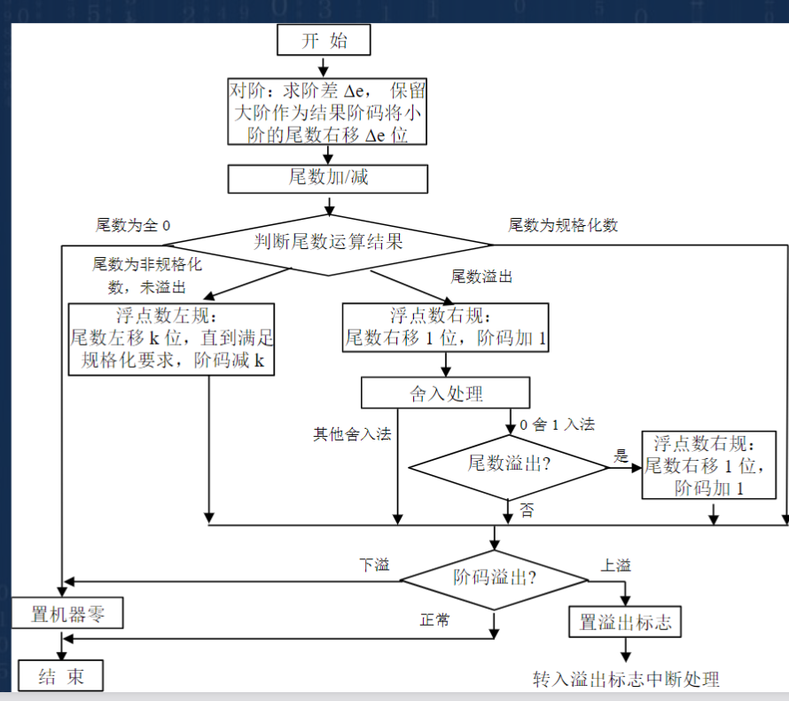
- 规格化乘除计算：
    - 乘法：尾数相乘，阶码相加;除法：尾数相除，阶码相减。要求$|被除数| < |除数|$。
    - 在尾数乘除后，如果非规格化则需要规格化。**在右规时如果出现阶码上溢，则必须要转入溢出处理**。
- 阶码运算：
    1. 若阶码用移码表示，则移码相加后需要**将符号位取反**，得到结果的移码；加减时，也可以**将加数或减数的符号位取反(即+补码和+(-补码))**再计算。
    2. 使用双符号位计算移码，**初始规定$S_{f1} = 0$**，则当计算后$S_{f1}$为0时未溢出，当$S_{f1}$为1时溢出了。10上溢，11下溢，00负数，01正数。

##数据存储
存储非数值型数据。
- 逻辑数：与或非，按位进行，表示是非01关系
- 字符与字符串：
    - ACSII:
        1. 7位二进制数字表示128个符号，包括0-9、a-z、A-Z、符号和控制符，包括$b_{6-4}$高位部分和$b_{3-0}$低位部分。
        2. 通常一个字节（8位）表示一个字符，7位ASCII码最高位的作用是：奇偶校验位；表示字符，用于扩展ASCII；表明汉字。
        3. 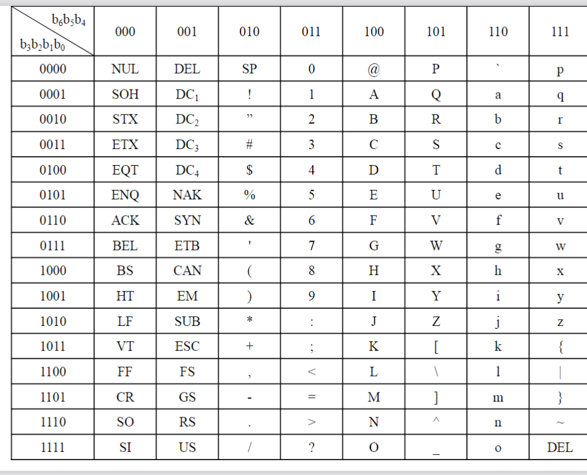
    - 汉字
        1. 
        2. 汉字输入码：音码（拼音）；形码（五笔）。
        3. 汉字交换码：国标码，用两个字节表示，每个字节只使用低7位。区号（49）位号（07）拼接（49 07），转换为两个8位二进制数（只使用低7位00110001 00000111），分别加上32（00100000），变为国标码（5127H）
        4. 汉字机内码：国标码的两个最高位置1，可以用于存储和读取字形码
        5. 汉字字形码：点阵、矢量码
## 数据长度和存储方式
- 数据长度：
    1. 位:一个0/1，一bit比特
    2. 字节：8位，Byte
    3. 字：
        - 在计算机系统中能被**同时存取和操作的一组二进制数**；
        - 字长：计算机中的字的二进制位数，**反映了CPU内部数据通道的宽度**。现在是4/8字节处理器，即32和64位处理器。一般来说，字长越长精度越高，且计算速度越快。
- C语言中的数据：
    - (unsigned)short/int/long；在数字后面加u表示无符号数，12345u；采用补码表示。可以通过不同解释方法来输出不同内容，例如带符号数-1的补码位11111111 11111111......，则通过输出无符号整数会输出$2^32-1$(32位机器中)
    - char：表示字符，用ASCII表示，8位，一个字节，可以表示字符和8位整数
    - 一个表达式中同时含有带符号数和无符号数，解释器会强制全部转换为无符号数进行运算。
    - char：8bit；short、int最少16bit；long最少32bit；short<int<long
    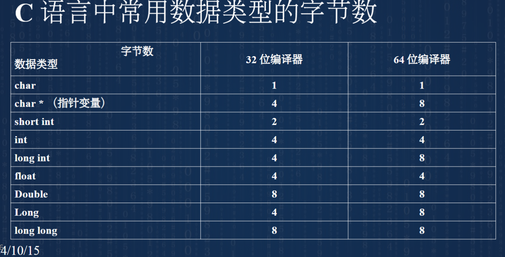
    - 类型转换
        1. 带符号数和无符号数的转换，有意想不到的结果
        2. int转换为float时，**float尾数不够可能导致舍入**。转换为double精度更高。
        3. double转换为float时，数据可能溢出，且尾数可能被舍入
        4. float或doube转换为int时，舍入或溢出
        - 注意：double + float - double可能会导致对阶的时候溢出，不像Java会强制转换为double
- 存储方式
    - 需要制定最高有效位MSB（符号位）和最低有效位LSB（最低位）。有字节存储顺序。
    - 大端排序方式：在主存中的最低存储位置（开始地址，如1000H）存储一个数字的最高有效位，从高到低存储。即MSB存储在低地址，LSB存储在高地址。
    - 小端排序方式：LSB存储在低地址单元，MSB存储在高地址单元。
    存储数字时要知道，二进制数字左侧是高位置，存储方式是$b_6b_5...b_1b_0$
    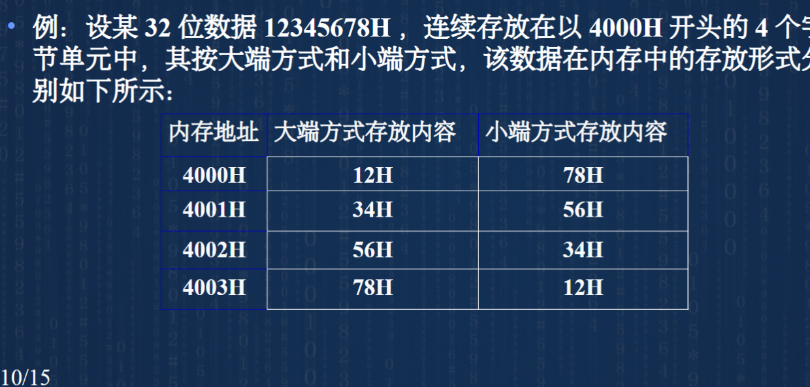

## 校验码
具有检测某些错误或带有自动纠正错误能力的数据编码方式。
- 码距和数据校验码：
    - 码距：
        1. 编码的距离：通常指一组编码中，**任何两个编码之间代码不同的位数**称为这两个编码的距离，也称海明距离
        2. 码距：**一组编码中的最小距离**
        - 例：1001和1011只有一位不同，（海明）距离为1；一组编码使用0000-1111这16个编码，每个相邻编码之间只有1位不同，**码距为1，任何出错时都会变为合法编码，没有纠错能力**
    - 校验码：
        1. 在正常编码下增加特殊规则的**校验位**，**增大码距来进行校验**。要
        2. 要检查e位错误，需要e+1码距
        3. 修正错误时只需要取反。修正t位错误需要2t+1码距。原因：发生t位错误后，非法编码距离合法仍差t距离，可以唯一确定错误位置。
### 奇偶校验码
在有效编码的**最高位前或最低位后**增加一位P。
- 奇校验：加上P后，1的个数为奇数。
- 偶校验：加上P后，1的个数为偶数。可以使用n位异或元件。如共7位有效位，加上P为8位，则$Peven = P_6 \oplus P_5 ... \oplus P_0 \oplus P;Podd = Peven取反$
### 海明校验码
在奇偶校验码的基础上额外增加校验位，以便**检测和纠正**(只能纠正一位错误)。设有效位为n，校验位为k，要达到**错1纠1**，**要满足$2^k \geq n + k + 1$**
- 编码方式：
    1. n位有效位，k位校验码。按照$2^k \geq n + k + 1$寻找最小k。构成一个n+k位编码。
    2. 设编码为$C_1C_2...C_{n+k}$，则所有校验码P位于$2^i，i:[0,k-1]$。
    3. 每一个有效位A都被至少两个校验位P校验；**被校验的位号=某些校验位号之和** 
    4. 例：
        1. n=7,则k=4；则编码时有$P_1P_2A_6P_4A_5A_4A_3P_8A_2A_1A_0$
        2. $A_6$的位号为3，3=1+2，则$A_6$被$P_1P_2$校验...
        3. 得到校验组：
        4. **每组的每个有效位进行异或，可以得到$P_keven$或$P_kodd$**，注意异或的个数对奇偶校验的影响:奇数个异或起来为even，偶数个异或起来反even（odd）
- 校验方式：
    1. k位校验码形成“指误字”：$P_kP_{k-1}...P_1$。若$P_i$组**检验成功则为0，否则为1**.
    2. 全0则无错。若非全0，则**指误字对应十进制代码就是出错位置**。
- 扩展的海明校验码：检2纠1，在最高位增加一个$P_0$，表示$n+k$位一共有多少个1，进行奇偶校验。检验时，先异或全部位，判断$E_0$是否通过检验；再去除$E_0和P_0进行分组检验$。

- 码距$d \geq e + t + 1$时，可以检e位错，纠t位错。
### 循环冗余CRC码
在模2运算下的多项式运算检验码。
- 模2运算
    1. 加减：即异或运算
    2. 模2乘：模2加求部分积之和，不进位: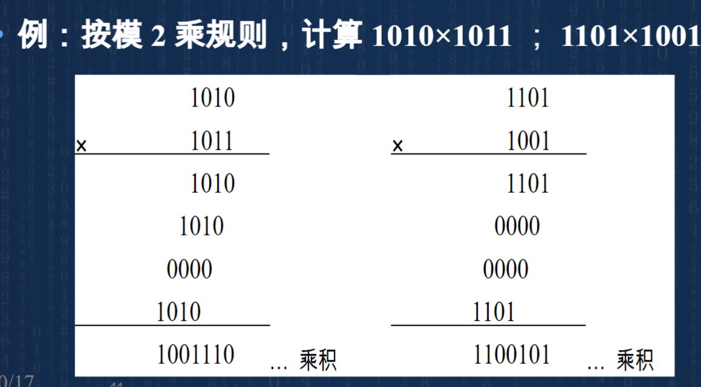
    3. 模2除：模2减求部分余数，部分余数（最初是被除数）最高位为1，则上商为1；最高位为0上商为0；去掉最高位继续运算；直到被除数位数小于除数。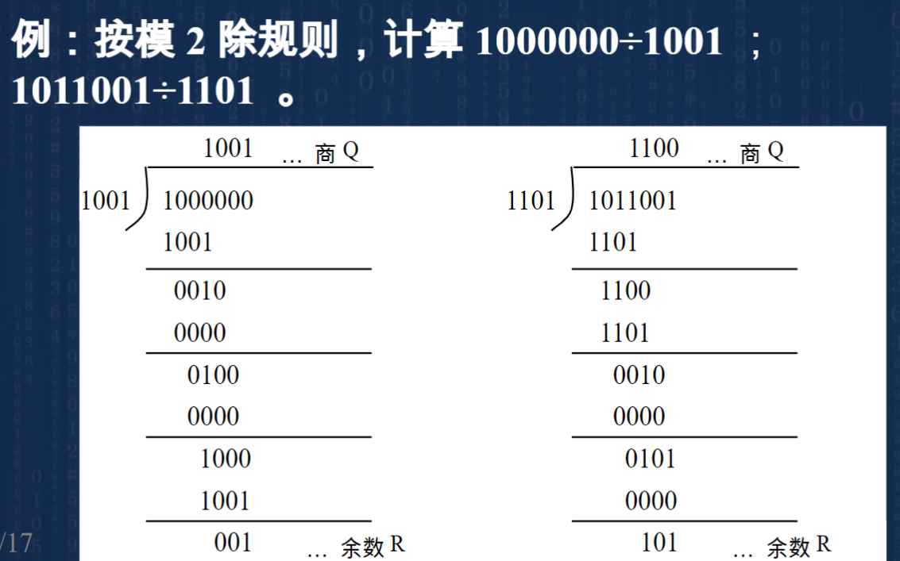
- 编码规则：
    1. 将待编n位码$C_{n-1}C_{n-2}...C_1C_0$编为多项式：$C_{n-1}x^{n-1} + C_{n-2}x^{n-2} ...C_0*x^0$。例如：$M(x) = 1001 = x^3 + 1$
    2. 选择一个k+1位码作为**约定除数**（**生成多项式**。例：$G(x) = 1011 = x^3+x+1$；要求：
        1. 任何位出错后，除$G(x)$后都不能使余数是0。
        2. 每个位出错后，余数不能相同
        3. 对余数循环除G(x)要能够循环
    3. 将M(x)左移k位(为了后续加R(x)时直接拼接)，得到了$M(x) × x^k$ ，计算$\frac{M(x)x^k}{G(x)}$，得到一个余数$R(x)$
    4. 将$M(x)x^k$与$R(x)$相加，得到循环冗余码CRC。则CRC码一定能整除G(x)
- 检验规则：收到的CRC与G(x)相除，余数为0则正确、余数不为0则需要根据余数纠正。出错位置index如表所示。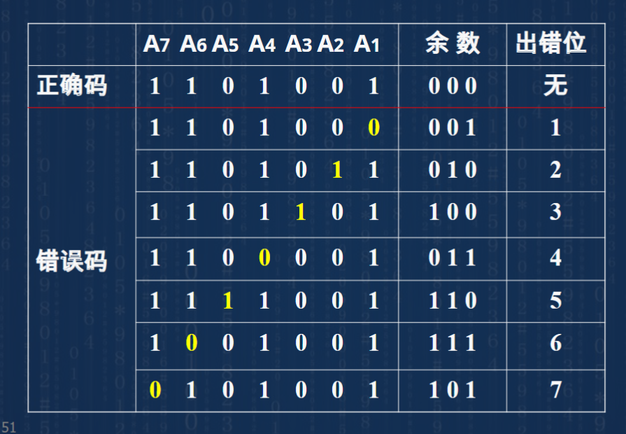
- 机器设计：若$\frac{M(x) x^k}{G(x)} $余数不为0，则反复在余数最后加0，继续除G(x)。同时每除一次，将CRC左移一位。出现最高位错误码后说明最高位出现了错误，取反即可。反复循环除并左移一个周期(n+k)次即可。

# 第三章 存储层次与系统
## 概述
存储器：存放程序(instructions)和数据(data)
### 存储器分类
    - 按照与CPU的关系来分类：
        1. 主存储器：CPU直接访问，内存/主存，存放当前使用的程序和数据。
        2. 辅助存储器：外部设备，外存/辅存。
        3. 高速缓冲存储器(Cache)：主存和cpu之间的高速小容量存储器。
    - 按照存取方式分类：
        1. 随机存取存储器RAM：任何数据都可以**按照地址随机存取**，主要用于主存
        2. 只读存储器ROM：只能随机读取，而不能读入。可以作为主存一部分。
        3. 顺序存储存储器SAM：排列、寻址、读写都是顺序的，如磁带。
        4. 直接存取存储器DAM：介于SAM和RAM，半顺序，如磁盘。
    - 存储介质：半导体存储器、磁表面存储器、光介质存储器。
### 层次结构
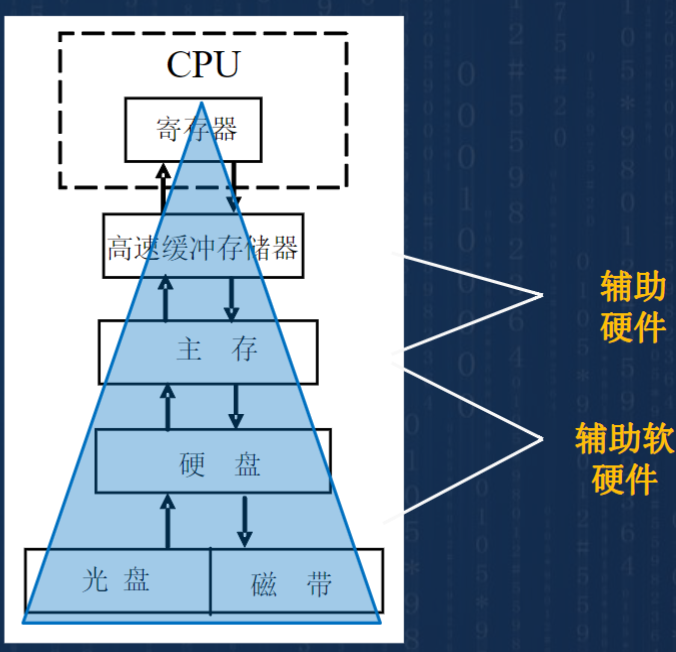
- 从上到下
    - 访问时间依次增长
    - 存储容量依次增大
    - 存储器每位价格依次增大
- 传统三级层次：
    - Cache-主存层次：**速度问题**，将主存和Cache构成统一，Cache速度、主存价格、容量
    - 主存-辅存层次：**容量问题**，大量数据存储在辅存中，使用时成批放入主存。
### 主存的组成和操作
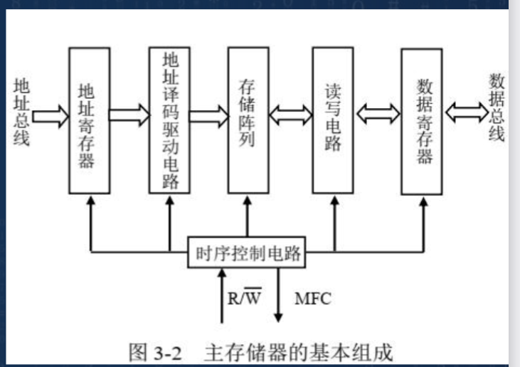
1. 存储阵列(存储体)的单元编码：每个存储单元的的地址统一编码，**地址码**。
    - 编址单位：字或字节(常用)。一个32位的字存储单元可以存储4字节；按字节编址时，占用4个字节地址。
    - 地址寄存器：保存需要读取的数据的地址，通过**地址总线**写入。
    - 地址译码与驱动电路：译出地址寄存器的地址，通过对应**地址选择线**选择相应地址，并提供驱动信号进行读写。
    - 读写电路：根据CPU控制读写
    - 数据寄存器：暂存要读写的数据。**是存储器与计算机其它功能部件联系的桥梁**
    - 时序控制电路：接受CPU的读写要求，输出时序信号来完成存取。如果采用异步时序电路，则完成后回发MFC（存储器操作完成）信号。
2. 存储器基本操作:
    主存储器存放CPU正在运行的程序和数据。
    - 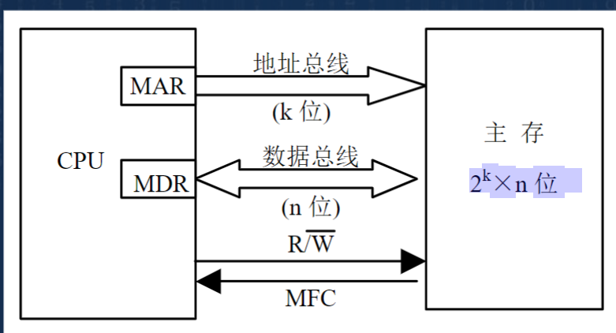
    - 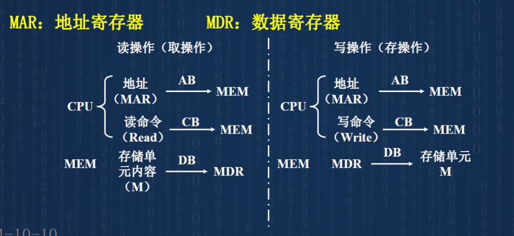
    - MAR：地址寄存器memory address register。MDR：数据寄存器memory data register;AB:address bus地址总线；CB:Control Bus控制总线；DB:Data Bus数据总线。
3. 异步/同步：同步在一个存取周期内完成(常用)；异步需要发MFC信号，但可采用不同速率的存储器作为主存。
### 存储器性能指标：
1. 存储容量：
    - 使用位表示：如256Mbit。或使用存储单元数×单元位数表示：512K×16位
    - 使用字节表示：4MB、16MB
2. 速度：存储芯片速度慢于CPU，**所以CPU速度很大取决于存储速度**
    1. 访问时间(取数时间$t_A$)：
        - 启动一次存取操作到完成消耗时间。读出时间：从存储器接入有效地址开始到产生输出时间；写入时间：从存储器接入有效地址到对应单元写入数据的时间。
        - $t_A$有关的参数：
            1. $t_CA$：从选片引脚信号有效开始到数据引脚信号有效的间隔
            2. $t_OE$：某些ROM的读信号有效到数据引脚信号有效的间隔
    2. 存取周期(存储周期，$T_M$)：连续进行两次存储操作后的间隔。由于存取一次后需要恢复，所以$T_M > t_A = t_a + 恢复时间$。
    3. 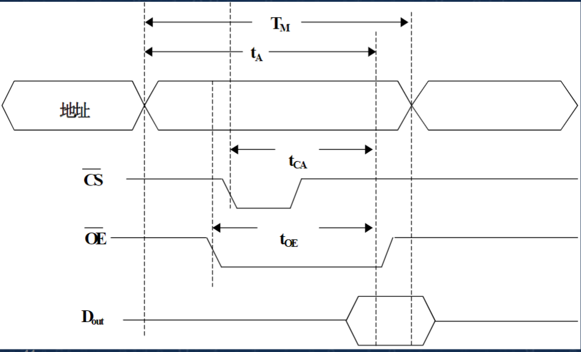
3. 存储器总线带宽(存储器数据传输率、频宽Bm)
    - 位/秒、字节/秒、兆字节/秒
    - 计算方法：
        1. 带宽 = 每个存取周期存储位数/周期时间；如500ns周期，存取16位二进制数，则$带宽 = 16 / 500ns = 32Mb/s$
        2. 带宽$B_m$ = 存储器总线宽度$W$(数据总线的根数)/周期$T_m$
    - 提高带宽：使用高速器件；降低周期，如使用Cache；增大总线宽度W;使用双端口存储器；加大字长。
4. 价格：用每位价格来衡量

## RAM与DRAM
- 半导体存储器分类：随机存取**可读写存储器**RAM（Random Access Memory）：
    1. 静态Static RAM（SRAM）：每一个存储单位都有一个触发器，不断电就可以保证二进制数据不丢失，**读写速度快，容量小**。但**断电丢失（易失）**
    2. 动态Dynamic RAM（DRAM）：采用MOS管和电容组成，电容漏电，需要频繁刷新。存储密度高，功耗小。有易失性。
### 单元电路：
1. 静态RAM
    - 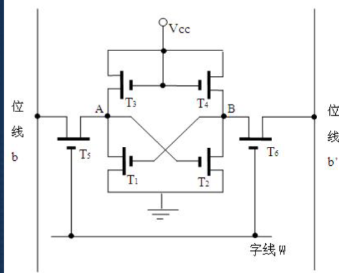
    - T1、T2触发器，存储数据；T3、T4负载；T5、T6构成门电路，连接字线W位线b，b'。
    - 写入数据：W字线高电平，导通T56；设置b/b'的高电平写入0/1;
    - 读出数据：W字线高电平；读取b/b'。**读取时不会破坏存储数据**
2. 动态RAM
    - 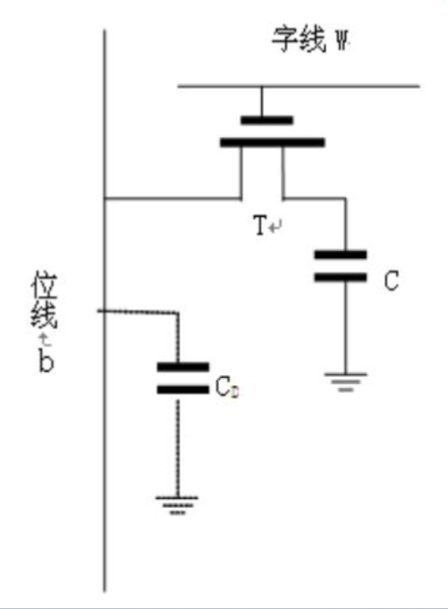
    - C是电容，有电荷表示1
    - 写入时，W高电平导通T1；b上高电平充电1；低电平放电0
    - 读出时，W高电平，若C有电则b上有微弱电流，使用再生放大器放大后读出1；对存储电荷有破坏性，需要再生放大器重新为其充电再生。
### 芯片结构和实例
- 芯片组成:
    1. 一个单元存储一个二进制数；
    2. 多个单元排列起来形成**阵列**，称为存储体/存储阵列。
    3. 阵列+外围电路(编码译码器、时序电路、驱动电路、放大器...)在硅板上=存储器组件
    4. 封装，引出地址线、控制线、数据线、电源线等引脚后为半导体存储器芯片
- 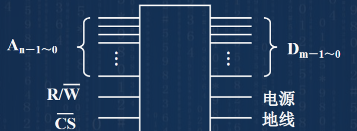
- 字片式结构（单译码）：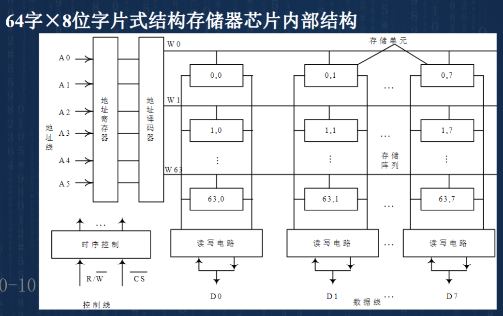
    1. 64字表示有64行，每行8位二进制的字，共64个字。**每行组成一个存储单元，存储一个字。**
    2. 有64个字线，由6位地址译码确定。
    3. 每个存储单元连接**1条W字线，2条b/b'位线**
    - R/W'：读写控制，0写，1读；CS'：片选控制，低电平0时选中该片工作，高电平1时未选中不工作。
    - 单译码:地址仅进行一个方向的译码(直接译某一行)，译码驱动电路数量多
- 位片式结构（双译码）: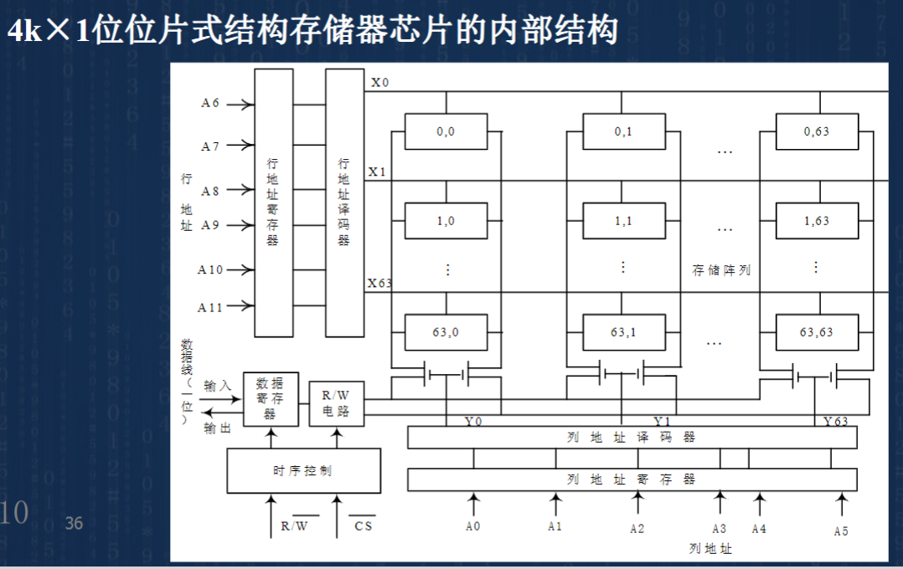
    1. 4k有4096个存储单元，64×64阵列，每次存储1位数据。
    2. 有12位地址，6位行6位列地址。行地址选中某一行进行读写；列地址打开MOS管，将对应列与读写电路连接。
    - 双译码：行列式译码，选中行和列交叉处。
- Intel 2114芯片(静态)：
    1. 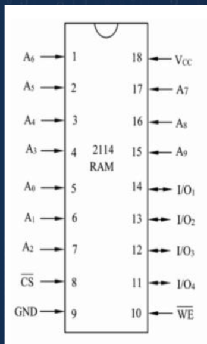
    2. 1K×4位。$A_0~A_9$10位地址线；$I/O_{1~4}$双向数据线。CS片选线；WE读写控制(0写1读)；GND地线。
    3. 采用二维译码；有4096个存储单元，排列为64×64。行译码64位，列译码16位，**每次行选中一行后，列同时选中4列**。
- TMS4116（动态）
    1. 
    
    2. 16K×1位；16384个动态MOS存储单元，组成128×128的阵列。分为两个64×128的阵列。行选择器选择128根字线，列选择器将列接入读写电路。列选择线128根，接入读出再生放大器（横），行分为两组64根。
    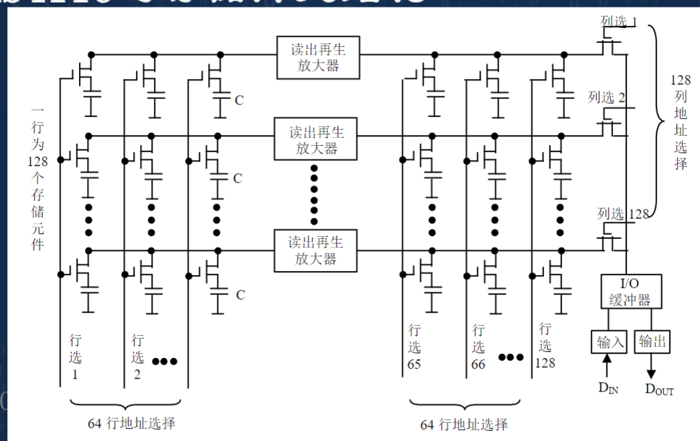
    3. RAS：Row Address Select，行地址选通；CAS:Coloum Address Select，列地址选通。
    - 读出：行选择一列128个再生放大器，则选出128位信号，且原电路会再生。

    

    

